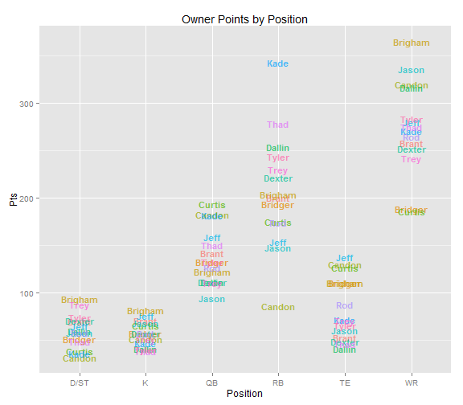
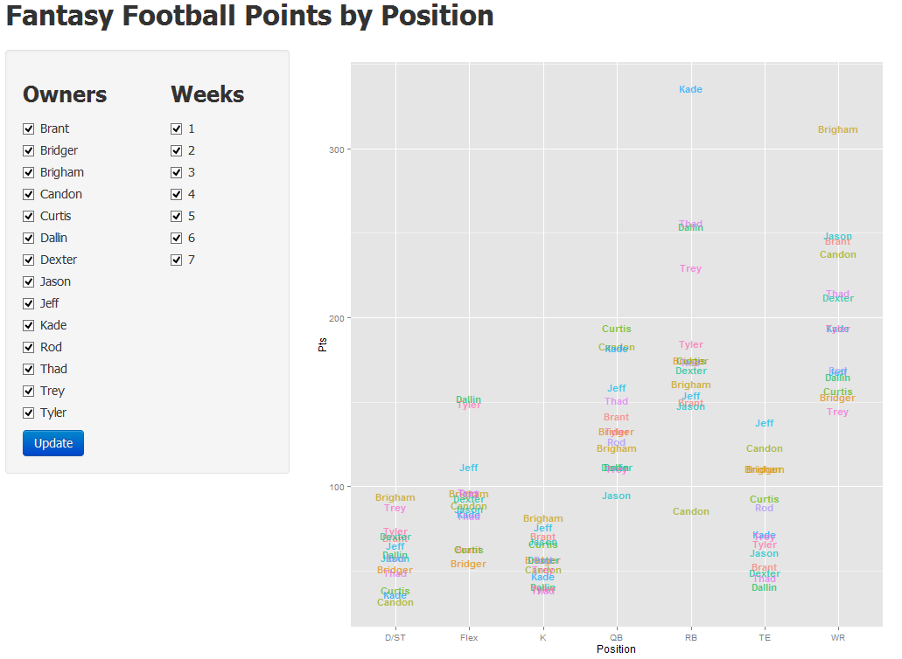

Fantasy Football Interactive Plots
========================================================
author: Thad Truman
date: 10-22-14
font-family: 'Calibri'
transition: rotate

========================================================

- <small>As fantasy football becomes increasingly popular, participants appreciate better products to monitor their team.
As the secretary of my league I have used R in the past to generate plots that give our ownership a better idea of how their respective teams are doing.  
- This plot is usefull and has been popular in our league. It shows how many points each owner has scored broken out by position.</small> 

**********

- <small>An owner can look at this and see how he/she compares to other owners at each position.</small>

========================================================

- While this plot is nice, it is a little difficult to see where owners rank in some of the more    congested positions.

- Also, maybe one doesn't care about the points scored over the entire season and wants to know how they stacked up last week or the last three weeks, and only against their next opponent.

- With shiny I was able to create an interactive plot like the one in the previous slide but it allows the user to choose what weeks and owners to include in the plot.

Shiny App 
============================================================
type: prompt

Summary
=============================================================

* With the growth of fantasy football, participants want better analysis tools
* While R plots are an improvement over what fantasy sites typically offer, Shiny Apps take this to another level.  (See link to plot below)

[Fantasy Football Shiny App](http://tbt8.shinyapps.io/DevDataProdCourseProject/)
